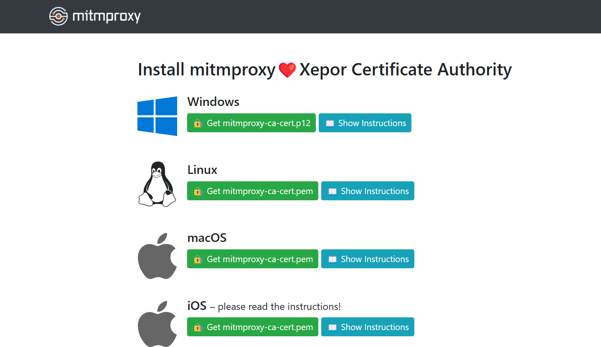

# Minimal working example

Run mitmproxy with `example.py` script in this directory.

```bash
mitmweb --web-host=\* --no-web-open-browser --set connection_strategy=lazy -s example.py
```

Set browser HTTP proxy to `http://127.0.0.1:8080`

Access http://mitm.it/

In this demo, the xepor script change the page body including the content *mitmproxy❤️Xepor*



