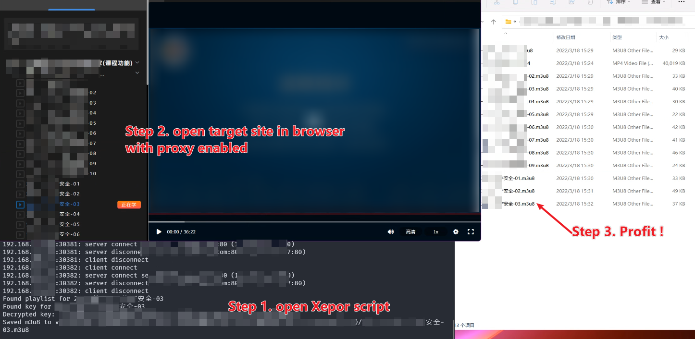

# Bypass video DRM with Xepor

... in \~100 lines of code!

This script is used to bypass a video DRM system, to decrypt and download online courseware, which is *clearly* against its ToS. So the core implementation of decryption algorithm is removed from this example. Other sensitive information is replaced with `REDACTED_CONSTANT`.

The script is only for demonstration of Xepor's (unlimited) potential. It collects and caches the key, KeK, video links from multiple requests, and forward everything transparently. As soon as everything needed is collected, it dumps out the decrypted video file.

In this example, the victim site is using a video DRM service provided by [POLYV](https://www.polyv.net/vod/en/).

> *POLYV* is China's largest video hosting and live streaming service for business. We provide video hosting (Video Cloud), video streaming service (Live Streaming Cloud) as well as tailored video solution for your business, promoting your brand and service in China. Our goal is to present your brand across the world and make it more valuable.

 
More details on their DRM solution

> ###  Digital Rights Management
>
> POLYV provides leading-edge solutions for keeping your videos secured -- from Rights Access Management (RAM), watermarking, token authentications, geo-restriction, to our patented PlaySafe® Digital Rights Management (DRM), we help you securely deliver your content with no concern.

> ### 视频全流程加密体系
>
> - 业内首创H5播放器加密，手机APP、网页、微信等全终端视频加密保护
> - 多维度防盗播，可指定网站播放；用户一ID一码观看，避免非法传播观看
> - 智能防翻录，支持浏览器防录屏、ID跑马灯、视频水印等多种防录屏方式
> - 全网盗版视频监测，提供绿色通道，帮助机构快速下架市面盗版视频

Frontend watermarking saves compute resources at backend but is easier to break. We don't tamper with the frontend in the browser because we are the Man In The Middle 😄

Use mitmproxy + Xepor saved considerably amount of work to write a video crawler. Every operation is done in a *real* browser. We don't even need to analyze the authorization (login, captcha), the integrity check (sign, CSRF), anti-scraping(selenium, webdriver check), etc. We only focus on the encryption. Also, we don't have to forge the request, handle cookies, schedule scrape jobs. It's boring, and over-engineered for a discard-after-use script.

In this example, we setup the mitmproxy, open the video as usual, and the decrypted videos will be saved into script directory. FFmpeg and VLC will happily recognize the video file.

