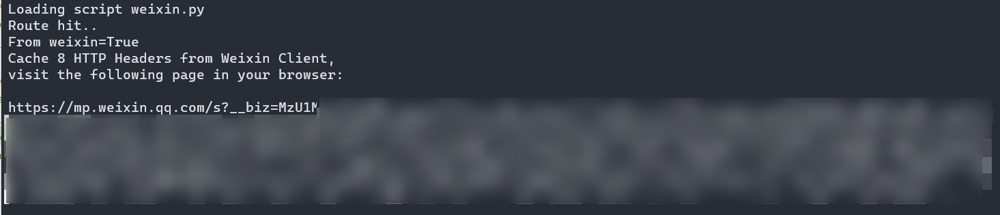
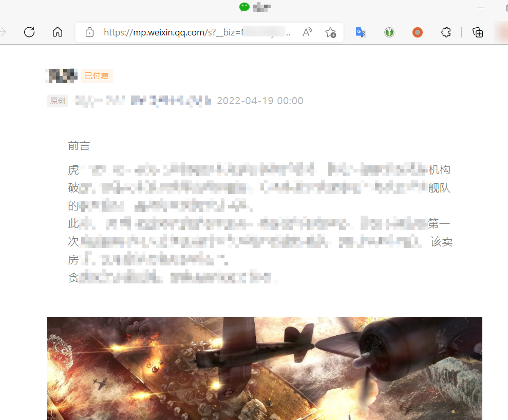

# Save paid articles from Weixin with web clipper

**DISCLAIMER: This script DOES NOT bypass the paywall, it only help you save the content that you paid for.**

In Weixin ecosystem, authors could restrict specific articles to be accessed only with a purchase (i.e. paywall). These articles are protected by Weixin client preventing users from copying the content. Users cannot view the full content inside a regular Web browser.

With [Xepor](https://github.com/xepor/xepor), we can easily sniff the HTTPS traffic from Weixin client and construct a similar URL request inside our web browser, as usual, *not* analysing and *not* reversing anything.

After opening the *paid* article inside web browser, we can copy/archive/webclip the content as we need 😉

# Usage example

Launch Weixin client and **pay** the article you want to archive. Their client software is available for Windows and Mac.

Setup MITM environment with tun2socks/proxifier(recommanded)/iptables, whichever way you like. The web browser also has to be configured to use the proxy.

Open paid article inside Weixin client. mitmproxy console will give you an URL.

Open the URL in your browser. Profit!

The URL expires very soon (in <10 minutes) so save the content as soon as you get it.
